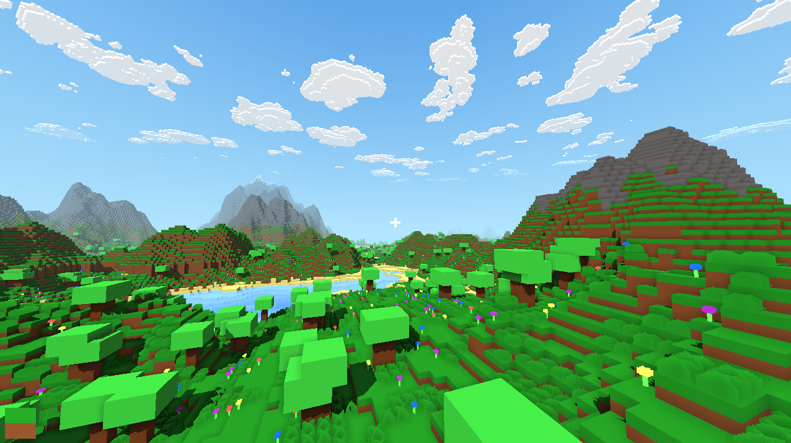

# Blocks



Tiny Minecraft clone in C and GLSL using the new SDL3 GPU API

### Features

- Procedural world generation
- Parallel chunk loading
- Blocks and plants
- Transparency (limited)
- Deferred rendering
- Directional shadows
- SSAO (ish, see [here](#ssao))
- Water depth shading
- Persistent worlds

### Building

#### Windows

Install the [Vulkan SDK](https://www.lunarg.com/vulkan-sdk/) for glslc

```bash
git clone https://github.com/jsoulier/blocks --recurse-submodules
cd blocks
mkdir build
cd build
cmake ..
cmake --build . --parallel 8 --config Release
cd bin
./blocks.exe
```

#### Linux

```bash
sudo apt install glslc
```

```bash
git clone https://github.com/jsoulier/blocks --recurse-submodules
cd blocks
mkdir build
cd build
cmake .. -DCMAKE_BUILD_TYPE=Release
cmake --build . --parallel 8
cd bin
./blocks
```

### Controls
- `WASDEQ` to move
- `Escape` to unfocus
- `LClick` to break a block
- `RClick` to place a block
- `B` to toggle blocks
- `F11` to toggle fullscreen
- `LControl` to move quickly
- `LShift` to move slowly

### Rendering

The rendering uses a combination of deferred and forward rendering techniques.
The rendering pipeline is:

1. Draw the sky to the g-buffer
2. Draw the world from the sun's perspective to a depth texture (shadows)
3. Draw the world (opaque only) to the g-buffer
4. Calculate SSAO using the g-buffer
5. Combine the g-buffer, SSAO, and shadows together to create a composite texture
6. Draw the world (transparent only) with blending to the composite texture
7. Draw the raycast block to the composite texture
8. Upscale the composite texture to the swapchain texture
9. Draw the UI over the swapchain texture
10. Submit

#### SSAO

> NOTE: Use CPU-based techniques. SSAO is cool but significantly hurts performance and looks worse.

SSAO is pretty finicky, especially in blocky games.
The idea I had was to manually check the neighbouring pixels to see if the current pixel is concave or convex. If it's concave, it's occluded.
I ended up checking the normals to see the direction the pixel was facing and checking if the world-space position was in front or behind the neighbours.

However, when the pixels are close to the screen, you have to traverse more pixels.
To traverse further, I scaled the traversal distance by the inverse of the world space depth.
To fix banding, I also combined the traversal with a noise texture to modulate the traversal distance and give a smooth (ish) gradient.